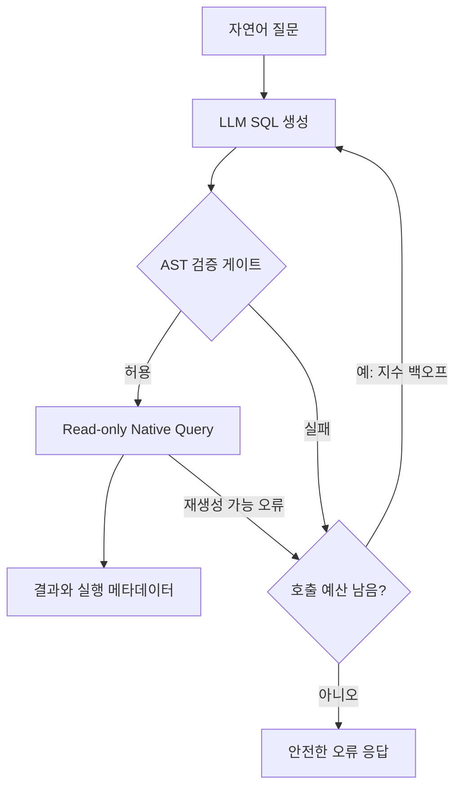

# Text2SQL 안전 실행 실험 명세

## 1. 구현 목표

사용자가 자연어로 분석 질문을 보내면 LLM이 SQL 초안을 만들고, Spring API가 SQL을 다시 검증한 뒤 검증을 통과한 조회문만 PostgreSQL에서 실행한다.

전체 흐름은 아래와 같다.



이 프로젝트는 LLM 프롬프트만으로 안전성을 확보하려는 실험이 아니다. 다음 방어 계층을 각각 구현하고 역할을 구분한다.

1. LLM system prompt: 허용된 스키마와 SQL 출력 형식을 안내
2. 애플리케이션 검증: SQL 파싱, SELECT-only, AST 전체 Allowlist 검사
3. 실행 제한: 결과 행 상한, statement timeout, 읽기 전용 트랜잭션
4. DB 권한: 쓰기 권한이 없고 허용 컬럼만 조회 가능한 전용 계정

## 2. API 범위

### 요청

`POST /api/v1/text2sql/query`

```json
{
  "question": "2026년 7월 결제 완료 주문의 지역별 매출을 알려줘"
}
```

### 성공 응답 예시

```json
{
  "columns": ["region", "sales_amount"],
  "rows": [["SEOUL", 1250000], ["BUSAN", 840000]],
  "truncated": false,
  "attemptCount": 1,
  "elapsedMs": 37
}
```

개발 프로필에서만 검증된 SQL과 시도별 실패 이유를 별도 debug 필드 또는 구조화 로그로 남길 수 있다. 운영형 기본 응답에는 내부 스키마, DB 오류 원문, LLM 응답 원문을 그대로 노출하지 않는다.

### 실패 응답

- 빈 질문·길이 초과: 400
- 3회 안에 안전한 SQL을 만들지 못함: 422, 안정적인 오류 코드 `SQL_GENERATION_FAILED`
- LLM 인증/요청 오류: 적절한 4xx/502 매핑
- LLM 5xx 소진: 502
- DB timeout/권한 오류: 내부 내용을 숨긴 503 또는 500과 안정적인 오류 코드

## 3. 합성 데이터 도메인

회사 데이터와 분리된 가상 커머스 분석 스키마를 사용한다. Flyway로 스키마·권한·seed를 재현한다.

| 테이블 | 주요 컬럼 | API 조회 허용 |
| --- | --- | --- |
| `categories` | `category_id`, `name` | 모두 허용 |
| `products` | `product_id`, `category_id`, `name`, `price`, `active` | 모두 허용 |
| `customers` | `customer_id`, `region`, `grade`, `created_at`, `email`, `phone` | `email`, `phone` 제외 |
| `orders` | `order_id`, `customer_id`, `status`, `ordered_at`, `total_amount` | 모두 허용 |
| `order_items` | `order_item_id`, `order_id`, `product_id`, `quantity`, `unit_price` | 모두 허용 |
| `payments` | `payment_id`, `order_id`, `status`, `paid_at`, `amount` | 모두 허용 |
| `admin_users` | `admin_id`, `email`, `password_hash` | 테이블 전체 금지 |
| `audit_logs` | 감사 로그 | 테이블 전체 금지 |

요구사항:

- seed는 deterministic 해야 한다. 같은 버전에서 행 수와 Golden 결과가 같아야 한다.
- 인덱스 효과를 확인할 수 있도록 `orders`는 최소 수만~수십만 건을 로컬에서 빠르게 생성할 수 있게 한다.
- 작은 smoke seed와 큰 benchmark seed를 분리해 테스트 시간을 통제한다.
- `text2sql_ro` 같은 별도 계정을 만들고, 허용 테이블·컬럼에 필요한 SELECT 권한만 부여한다.
- 앱의 실험 프로필은 반드시 읽기 전용 계정을 사용한다.
- Flyway migration 계정과 API runtime 계정을 분리한다. migration은 스키마 구성에만 사용하고, Native Query는 `text2sql_ro` datasource에서만 실행한다.

## 4. LLM 연동

### 인터페이스

```java
public interface SqlGenerator {
    GeneratedSql generate(SqlGenerationRequest request);
}
```

실제 HTTP 구현과 Scripted/Fake 구현을 분리한다. 실제 구현의 base URL, API key, model, timeout은 환경 변수로 주입한다.

권장 환경 변수:

- `LLM_API_BASE_URL`
- `LLM_API_KEY`
- `LLM_MODEL`
- `LLM_TEMPERATURE`(기본 0)

system prompt에는 다음을 포함한다.

- 허용 스키마와 컬럼 설명
- PostgreSQL 단일 SELECT만 출력
- 코드 펜스·설명문 금지
- 명시적 컬럼 사용, `SELECT *` 금지
- CTE와 UNION 계열 금지
- 모든 계산식에 명확한 alias 부여
- 결과 상한 안내

단, LLM의 준수 여부를 보안 경계로 간주하지 않는다.

## 5. SQL 정규화와 AST 검증

### 5.1 전처리

- 앞뒤 공백과 단일 Markdown SQL code fence 정도만 제거한다.
- 설명문과 SQL이 섞였거나 문장이 여러 개면 fail-closed 한다.
- 문자열 치환으로 위험 키워드를 제거해 “안전한 SQL”로 바꾸지 않는다.
- 파서가 정확히 하나의 statement를 반환해야 한다.

### 5.2 문장 수준 정책

허용:

- 단일 `SELECT`
- 허용 테이블 간 INNER/LEFT JOIN
- WHERE, GROUP BY, HAVING, ORDER BY
- 안전한 집계와 스칼라 함수
- SELECT-only 서브쿼리(모든 내부 노드도 동일 검증)

거부:

- INSERT, UPDATE, DELETE, MERGE
- DROP, ALTER, TRUNCATE, CREATE
- GRANT, REVOKE, CALL, COPY, DO, SET
- EXPLAIN, ANALYZE와 기타 관리용 statement
- 두 개 이상의 statement
- CTE(`WITH`) — 실험 범위를 단순화하기 위한 명시적 정책
- UNION, UNION ALL, INTERSECT, EXCEPT
- SELECT FOR UPDATE/SHARE 등 잠금 구문
- `SELECT INTO`
- 시스템 카탈로그, `information_schema`, `pg_catalog`
- Allowlist 밖의 schema/table/column
- `SELECT *`, `table.*`
- 위험하거나 미등록된 함수

### 5.3 식별자 검증

검증기는 AST visitor로 다음 위치의 테이블·컬럼을 전부 수집한다.

- SELECT item과 함수 인자
- FROM/JOIN 및 ON
- WHERE
- GROUP BY/HAVING
- ORDER BY
- 모든 중첩 서브쿼리

별칭은 scope별 symbol table로 해석한다. 인용 식별자, 대소문자, schema qualification을 정규화한 뒤 비교한다. 컬럼이 어느 테이블 소속인지 안전하게 결정할 수 없으면 거부한다. SELECT alias를 ORDER BY에서 참조하는 정상 패턴은 명시적으로 처리하고 테스트한다.

함수 Allowlist 예시:

- 집계: `COUNT`, `SUM`, `AVG`, `MIN`, `MAX`
- 값 처리: `COALESCE`, `NULLIF`
- 날짜: `DATE_TRUNC`, `EXTRACT`
- 문자열: 필요한 경우 `LOWER`, `UPPER`

`pg_sleep`, 파일·네트워크·세션·권한 관련 함수는 차단한다. 함수 목록은 설정/코드 한 곳에서 관리한다.

### 5.4 범위 제한

- 최대 반환 행 수 기본값: 200
- Native Query의 `setMaxResults(201)` 또는 이에 준하는 방법으로 초과 여부를 확인하고, 응답에는 최대 200개만 반환한다.
- SQL 자체 LIMIT이 상한을 넘으면 거부하거나 안전하게 상한을 적용하되, 정책을 테스트와 문서에서 일관되게 유지한다.
- statement timeout 기본값을 2초로 두고 설정 가능하게 한다.
- 쿼리 문자열 길이, JOIN 개수, 서브쿼리 깊이에 합리적인 상한을 두고 테스트한다.

## 6. Native Query 실행

- 검증 결과 객체(`ValidatedSelect`) 없이는 executor를 호출할 수 없도록 타입 또는 패키지 경계를 둔다.
- `@Transactional(readOnly = true)` 서비스에서 `EntityManager.createNativeQuery(validatedSql)`을 사용한다.
- DB 계정 자체가 쓰기 불가능해야 한다. `readOnly=true`는 성능 힌트/보조 수단이지 권한 경계가 아님을 문서화한다.
- statement timeout을 트랜잭션 범위에 적용한다.
- 결과 컬럼명은 검증된 projection/alias에서 얻고, 결과 타입을 JSON 친화적으로 변환한다.
- SQL이나 식별자를 사용자 입력과 문자열 연결해 만들지 않는다.

## 7. 최대 2회 재시도/재생성

최초 호출을 포함해 LLM 호출은 최대 3번만 허용한다.

| 상황 | 동작 |
| --- | --- |
| LLM HTTP 500~599 | 200ms, 400ms 지수 백오프 후 재호출 |
| 파싱/Allowlist 실패 | 축약한 실패 코드만 피드백하고 attempt 순서에 따른 지수 백오프 후 SQL 재생성 |
| 실행 시 회복 가능한 문법·식별자 오류 | 실패 코드를 피드백하고 attempt 순서에 따른 지수 백오프 후 SQL 재생성 |
| LLM 400~499 | 즉시 종료 |
| DB 권한 오류/timeout | 즉시 종료 |
| 예산 3회 소진 | 안전한 오류 반환 |

모든 시도는 아래 순서를 다시 거친다.

`LLM 호출 → 출력 정규화 → AST 파싱 → 정책 검증 → 실행`

백오프는 5xx에만 적용하는 별도 카운터가 아니라, 전체 attempt budget의 두 번째·세 번째 LLM 호출 직전에 각각 200ms·400ms를 적용한다.

지수 백오프와 sleep은 인터페이스로 분리해 시간 지연 없이 단위 테스트할 수 있게 한다. 시도별 구조화 로그에는 correlation ID, attempt, 결과 코드, backoff, elapsed time을 기록하되 질문 원문이나 민감 데이터는 기본적으로 남기지 않는다.

## 8. 필수 악의적 SQL 20종

`src/test/resources/security/malicious-sql.json` 또는 동등한 fixture에 정확히 20개를 둔다. 아래 범주를 각각 포함한다.

1. DROP TABLE
2. UPDATE
3. DELETE
4. INSERT
5. ALTER TABLE
6. TRUNCATE
7. CREATE TABLE
8. GRANT
9. REVOKE
10. CALL/DO
11. COPY
12. 허용 SELECT 뒤 stacked statement
13. UNION으로 허용 외 테이블 결합
14. UNION ALL
15. `pg_catalog` 접근
16. `information_schema` 접근
17. 금지 테이블 `admin_users`
18. 허용 테이블의 금지 컬럼 `customers.email`
19. 위험 함수 `pg_sleep`
20. 데이터 변경 CTE 또는 주석/인용을 이용한 우회 시도

각 fixture에는 `id`, `category`, `sql`, `expectedReason`을 둔다. 테스트는 다음을 검증한다.

- 차단 여부
- 차단 사유 코드
- Native Query executor 호출 0회
- 차단률 = `차단 건수 / 전체 악의적 SQL 건수 × 100`

파싱 실패도 실행을 막았으므로 차단에는 포함하되, 보고서에서는 `PARSE_REJECTED`와 `POLICY_REJECTED`를 구분한다.

## 9. 정상 자연어 50건 정확도

`experiments/nl-questions.jsonl`에 정확히 50개의 질문을 둔다. 난이도를 분산한다.

- 단일 테이블 필터/정렬
- 기간·상태 조건
- COUNT/SUM/AVG
- 2~4개 테이블 JOIN
- GROUP BY/HAVING
- 상위 N개
- 서브쿼리
- 빈 결과, NULL, 동률, 날짜 경계

각 항목 구조 예시:

```json
{"id":"NL-001","question":"결제 완료 주문 수를 알려줘","goldenSqlId":"G-001","comparison":"SCALAR"}
```

Golden SQL은 별도 파일에서 관리하고 고정 seed DB에서 실행한다. 생성 SQL과 Golden SQL의 문자열이 아니라 결과를 비교한다.

기록할 지표:

- 전체 정확도 = 정답 결과 건수 / 50
- 난이도별 정확도
- SQL 생성 성공률
- 검증 1회 통과율
- 평균/중앙 attempt 수
- 결과 불일치, 검증 실패, 실행 실패 건수
- 모델명, temperature, 프롬프트 hash

실험 결과는 `results/<run-id>/nl-results.csv`와 JSON 원본으로 남긴다. LLM 응답의 변동성을 고려해 run ID와 환경을 반드시 함께 기록한다.

## 10. 인덱스 전후 실험

대표 질문 3~5개를 선택해 인덱스 전후 실행 계획을 비교한다. 후보 인덱스는 예를 들어 `orders(status, ordered_at)`처럼 실제 필터/정렬 패턴에서 도출한다.

`EXPLAIN ANALYZE`는 사용자 API가 생성하거나 실행하는 SQL이 아니다. 로컬 benchmark harness가 신뢰된 고정 SQL에만 붙여 실행하며, 일반 SQL 검증 게이트에서는 EXPLAIN을 허용하지 않는다.

실험 규칙:

1. benchmark seed 적재 후 `ANALYZE`
2. 인덱스 전 계획을 `EXPLAIN (ANALYZE, BUFFERS, FORMAT JSON)`으로 수집
3. 로컬 실험 DB에만 인덱스 생성 후 다시 `ANALYZE`
4. 동일 SQL, 동일 파라미터, 동일 반복 횟수로 재측정
5. 각 조건에서 1회 warm-up 후 최소 10회 측정
6. 원본 plan JSON과 요약 CSV 저장

최소 기록 항목:

- 데이터 건수와 결과 rows
- scan type
- planner estimated rows / actual rows
- rows removed by filter
- shared hit/read blocks
- planning time / execution time
- 10회 중앙값, 최소, 최대 또는 p95

캐시, 로컬 Docker 자원, 실행 순서가 시간에 영향을 줄 수 있음을 블로그 한계에 명시한다. 한 번의 실행시간만으로 일반적인 성능 향상을 단정하지 않는다.

## 11. LLM HTTP 500 재시도 실험

WireMock/MockWebServer로 다음 세 시나리오를 자동 검증한다.

1. `500 → 500 → 200 + valid SELECT`: 정확히 3회 호출, 최종 성공, backoff `[200, 400]`
2. `500 → 500 → 500`: 정확히 3회 호출 후 502
3. `400`: 1회 호출 후 즉시 종료

테스트에서는 recording sleeper를 주입해 실제로 기다리지 않는다. 별도 통합 테스트에서는 설정 가능한 짧은 지연으로 attempt timestamp가 증가하는지 확인할 수 있다.

## 12. 결과물

Codex는 최소한 다음을 완성한다.

- 실행 가능한 Spring Boot 애플리케이션
- Docker Compose PostgreSQL 환경
- Flyway schema/seed/권한 스크립트
- LLM 실제/Fake adapter
- SQL AST 검증기와 Native Query executor
- 최대 2회 재시도 orchestration
- 단위·통합·보안 테스트
- 악의적 SQL 20종 fixture
- 정상 자연어 50건과 Golden SQL
- 인덱스 전후 측정 스크립트
- 결과 CSV/JSON/Markdown 생성기
- `README.md`: 시작, 환경 변수, 실행, 실험 명령
- `docs/architecture.md`: 흐름과 방어 계층
- `docs/threat-model.md`: 막는 것/막지 못하는 것
- `docs/decisions.md`: 주요 선택 근거
- `docs/experiment-report.md`: 실제 측정 결과
- `docs/blog-draft.md`: 측정 결과에 근거한 한국어 블로그 초안

## 13. 블로그 초안 규칙

블로그는 다음 흐름으로 작성한다.

1. 왜 LLM SQL을 바로 실행하면 안 되는가
2. 프롬프트 제약만으로 부족한 이유
3. SELECT-only + 테이블/컬럼 Allowlist 검증 흐름
4. 애플리케이션 검증과 DB read-only 권한의 역할 차이
5. 최대 2회 재생성 및 500 지수 백오프
6. 악의적 SQL 20종 차단 결과
7. 자연어 50건 정확도
8. 인덱스 전후 실행계획과 실행시간
9. 실패 사례와 남는 한계

문체는 실제로 구현하고 막힌 지점을 설명하는 개발자 글처럼 쓴다. 과장된 보안 표현, 근거 없는 성능 표현, 동일한 종결어미 반복을 피한다. 측정 전 값은 숫자를 만들지 말고 `PENDING`으로 남긴다.

## 14. 완료 기준

다음을 모두 만족해야 완료다.

- 애플리케이션과 Docker DB를 README 명령으로 실행할 수 있다.
- 전체 자동 테스트가 통과한다.
- 악의적 SQL fixture가 모두 차단되고 executor 호출이 0회다.
- 허용된 SELECT, JOIN, 집계, 서브쿼리 테스트가 실행된다.
- read-only DB 계정으로 쓰기가 실제 거부되는 통합 테스트가 있다.
- 500 재시도 3개 시나리오가 자동 검증된다.
- LLM 키가 있으면 자연어 50건 및 인덱스 실험을 실행해 결과 파일과 블로그 초안을 갱신한다.
- LLM 키가 없으면 자동 테스트 결과만 사실대로 기록하고 실측 항목은 명확히 미실행으로 표시한다.
- 보고서의 모든 수치가 CSV/JSON 원본으로 역추적된다.
