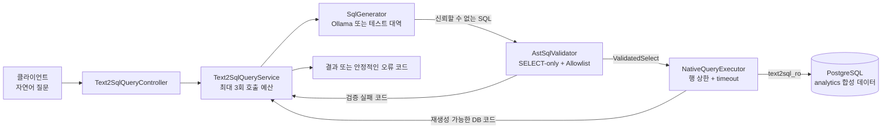
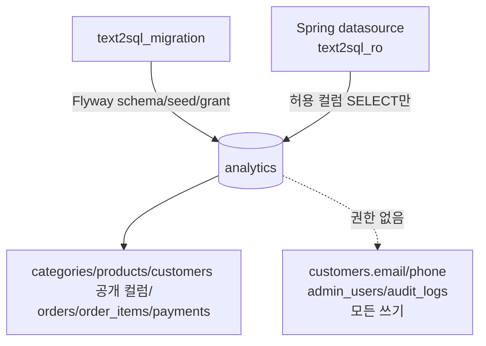

# 아키텍처

## 1. 범위와 원칙

이 프로젝트는 합성 커머스 데이터로 `자연어 → LLM SQL 생성 → SQL 검증 → 읽기 전용 실행`을
재현하는 개인 로컬 실험이다. 회사 시스템이나 운영 배포 사례가 아니며, 안전성의 기준을 LLM의
응답 품질에 두지 않는다. LLM 출력은 항상 신뢰할 수 없는 문자열로 시작하고, 애플리케이션과
데이터베이스가 독립된 제한을 겹쳐 적용한다.

Ollama는 유일한 실제 LLM adapter다. 기본 provider는 `disabled`이므로 Ollama와 모델이 없어도
애플리케이션과 자동 테스트가 시작된다. 유료 외부 API, 원격 LLM fallback, AWS 구성은 없다.

## 2. 전체 흐름

흐름에서 가장 중요한 경계는 `AstSqlValidator`와 `ValidatedSelect` 사이다. 생성 SQL 문자열은
검증기를 통과하기 전까지 실행기 입력 타입이 될 수 없다. 검증에 성공한 원문 SQL만
`EntityManager.createNativeQuery(...)`에 전달하며, 사용자 입력을 SQL 뒤에 이어 붙이지 않는다.

## 3. 요청 처리 단계

### 3.1 API 입력

`POST /api/v1/text2sql/query`는 `question` 하나를 받는다. 빈 질문과 설정된 최대 길이를 넘는 질문은
LLM을 호출하기 전에 거절한다. 성공 응답에는 컬럼, 행, 잘림 여부, 시도 횟수, 경과시간만 포함한다.
실패 응답은 내부 예외 메시지 대신 `SQL_GENERATION_FAILED`, `DB_TIMEOUT` 같은 안정적인 코드와
시도 횟수만 반환한다.

관련 구현:

- `src/main/java/dev/safetext2sql/api/Text2SqlQueryController.java`
- `src/main/java/dev/safetext2sql/api/Text2SqlExceptionHandler.java`

### 3.2 SQL 생성

`SqlGenerator`는 SQL 생성만 담당하고 허용 여부를 판단하지 않는다. 실제 구현인
`OllamaSqlGenerator`는 로컬 `/api/generate`를 `stream=false`로 호출한다. base URL은 HTTP/HTTPS의
loopback 주소만 허용하고 user-info를 거부한다. 모델명, temperature, 연결·응답 timeout은 설정으로
주입한다.

system prompt는 합성 스키마와 출력 규칙을 안내하지만 보안 경계가 아니다. 자연어 질문을 구분자로
나누고 재시도 때 안정적인 실패 코드만 제공해도, 모델이 지시를 지킨다고 가정하지 않는다.

관련 구현:

- `src/main/java/dev/safetext2sql/llm/SqlGenerator.java`
- `src/main/java/dev/safetext2sql/llm/ollama/OllamaSqlGenerator.java`
- `src/main/java/dev/safetext2sql/llm/prompt/SqlPromptTemplate.java`
- `src/main/java/dev/safetext2sql/llm/config/OllamaProperties.java`

### 3.3 AST 검증 게이트

`AstSqlValidator`는 JSqlParser 5.3 AST 전체를 재귀적으로 검사한다.

- 정확히 한 개의 SELECT만 허용한다.
- DDL/DML/DCL, 다중 문장, CTE, UNION 계열, 잠금, SELECT INTO를 거부한다.
- `analytics`의 공개 테이블 6개와 공개 컬럼만 허용한다.
- SELECT, JOIN/ON, WHERE, GROUP BY, HAVING, ORDER BY, 서브쿼리의 참조를 모두 해석한다.
- 별칭을 SELECT scope별로 관리하고 모호하거나 소유 관계를 해석할 수 없는 컬럼을 거부한다.
- `SELECT *`, `table.*`와 미등록 함수를 거부한다.
- SQL 길이, JOIN 수, 서브쿼리 깊이, 명시적 LIMIT/FETCH를 제한한다.
- 파서 오류나 지원하지 않는 AST 노드는 허용으로 추측하지 않고 fail-closed 한다.

성공 결과인 `ValidatedSelect`는 package-private 생성자를 사용한다. 일반 애플리케이션 코드가 원문
문자열을 검증 완료 값으로 임의 포장하는 공개 경로가 없다.

관련 구현:

- `src/main/java/dev/safetext2sql/sql/validation/AstSqlValidator.java`
- `src/main/java/dev/safetext2sql/sql/validation/AnalyticsSqlPolicy.java`
- `src/main/java/dev/safetext2sql/sql/validation/ValidatedSelect.java`

### 3.4 읽기 전용 실행

`NativeQueryExecutor`는 `ValidatedSelect`만 입력으로 받는다. 기본 응답 상한은 200행이고 DB
statement timeout은 2초다. 명시적 LIMIT/FETCH가 없는 SQL에는 JPA `setMaxResults(maxRows + 1)`을
적용해 잘림 여부를 확인한다. 최상위 LIMIT/FETCH는 AST에서 최대 200행으로 검증되므로 Hibernate가
중복 FETCH를 생성하지 않게 `setMaxResults`를 생략한다. 실행 설정이 더 작으면 반환 행은 다시 해당
상한으로 자른다.

`@Transactional(readOnly = true)`는 보조 힌트다. 실제 권한 경계는 쓰기 권한이 없고 공개 컬럼의
SELECT만 부여된 `text2sql_ro` 계정이다. SQLSTATE는 원문을 외부로 전달하지 않고 timeout, 권한,
재생성 가능한 식별자 오류, 기타 DB 오류로 축약한다.

관련 구현:

- `src/main/java/dev/safetext2sql/execution/NativeQueryExecutor.java`
- `src/main/java/dev/safetext2sql/execution/SqlExecutionProperties.java`
- `src/main/resources/db/migration/V3__grant_readonly_privileges.sql`

### 3.5 재시도와 종료

전체 LLM 호출 예산은 최초 호출을 포함해 최대 3회다. 두 번째와 세 번째 호출 직전에 기본
200ms, 400ms 지수 백오프를 적용한다.

| 실패 | 재호출 |
| --- | --- |
| Ollama HTTP 5xx | 예산 안에서 재호출 |
| AST 파싱·정책 실패 | 축약 코드만 전달하고 재생성 |
| 재생성 가능한 DB 문법·식별자 오류 | 축약 코드만 전달하고 재생성 |
| Ollama HTTP 4xx | 즉시 종료 |
| 전송·응답 형식 오류 | 즉시 종료 |
| DB 권한 오류·statement timeout·취소 | 즉시 종료 |

재생성된 SQL도 매번 처음부터 같은 AST 게이트를 통과한다. 검증에 실패한 SQL은 어느 시도에서도
실행기에 전달되지 않는다. 시도 로그에는 무작위 correlation ID, attempt, 결과 코드, backoff,
경과시간만 기록하고 질문·SQL·LLM 본문·DB 오류 원문은 기록하지 않는다.

관련 구현:

- `src/main/java/dev/safetext2sql/workflow/Text2SqlQueryService.java`
- `src/main/java/dev/safetext2sql/workflow/ExponentialBackoffPolicy.java`

## 4. 데이터베이스와 계정 분리

PostgreSQL 16.9는 Docker Compose로 실행한다. Flyway의 `text2sql_migration` 계정은 스키마와 seed를
관리하고, 애플리케이션 datasource는 고정된 `text2sql_ro` 계정을 사용한다.

기본 smoke seed는 주문 100건이다. 인덱스 실험용 반복 migration을 추가하면 orders,
order_items, payments가 각각 50,100행이 된다. 모든 이름과 값은 합성 데이터다.

## 5. 실험 아키텍처

제품 실행 경계와 측정 편의를 분리하되 보안 제약을 우회하지 않는다.

- 자연어 실험: 질문 50건과 Golden SQL 50건을 1:1로 연결하고 결과 집합을 비교한다. Ollama가
  없으면 Golden SQL의 AST·DB 실행만 검증하고 정확도는 `PENDING`이다.
- 인덱스 실험: 고정 SELECT 3개에만 harness가 EXPLAIN을 붙인다. 일반 API 검증기는 EXPLAIN을
  계속 거부한다. DDL은 migration 계정, EXPLAIN SELECT는 read-only 계정으로 실행한다.
- 재시도 실험: 실제 Ollama HTTP adapter와 실제 sleeper를 사용하고 서버만 WireMock으로 대체한다.

결과에는 run ID, UTC 시각, 측정 코드 SHA, OS, CPU, RAM, Java, PostgreSQL, Ollama/model,
temperature, prompt hash와 데이터 건수를 해당 범위에서 기록한다. 접속 URL과 비밀번호는 기록하지
않는다.

## 6. 테스트 계층

| 계층 | 검증 내용 |
| --- | --- |
| 단위 테스트 | 설정 상한, 프롬프트, 결과 비교, 백오프와 오류 분류 |
| WireMock | Ollama 요청/응답, 4xx/5xx, timeout, malformed JSON |
| AST 보안 fixture | 악의적 SQL 20건의 거절 코드와 executor 호출 0회 |
| Testcontainers | Flyway, DB 계정 권한, Native Query, 행 상한, statement timeout, API 배선 |
| Golden 통합 | Golden SQL 50건의 AST 검증과 고정 seed 실행 |

현재 자동 테스트와 실험 결과는 [실험 보고서](experiment-report.md)에 기록한다. 방어 범위와 남는
한계는 [위협 모델](threat-model.md)을 기준으로 해석해야 한다.
