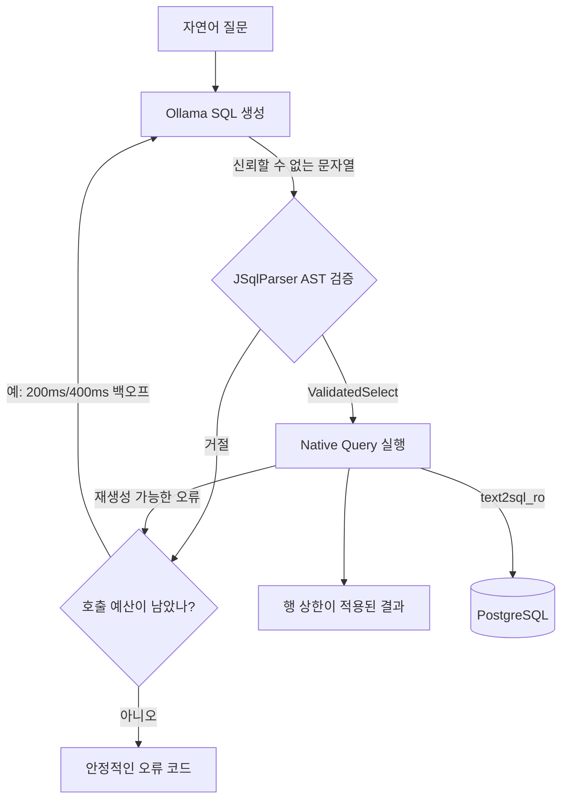

# LLM이 만든 SQL을 바로 실행하지 않기: AST 검증과 DB 권한을 겹친 로컬 실험

> 이 글은 합성 커머스 데이터와 로컬 Docker/Ollama로 만든 개인 실험 기록이다. 회사 프로젝트나
> 운영 배포 경험이 아니다. 자연어 50건은 Ollama 0.33.2와 `qwen3:4b-instruct`로 한 번 실제
> 측정했으며, 결과가 다른 모델·데이터·장비에도 그대로 적용된다고 주장하지 않는다.

## 시작: SQL을 잘 만드는 것과 안전하게 실행하는 것은 다른 문제였다

자연어로 “지난달 결제 완료 주문의 지역별 매출을 보여줘”라고 묻고 LLM이 SQL을 만들어 주면 꽤
편리하다. 문제는 그 다음이었다. 모델이 `SELECT` 대신 `DELETE`를 만들거나, 허용하지 않은 고객
이메일을 조회하거나, 설명문과 SQL 여러 개를 한꺼번에 반환하면 어떻게 해야 할까.

처음 떠올리기 쉬운 답은 system prompt에 “SELECT만 작성하라”고 강하게 적는 것이다. 하지만
프롬프트는 생성 품질을 높이는 지침이지 실행 권한을 부여할 보안 경계가 아니다. 사용자 질문에
프롬프트 인젝션이 들어갈 수도 있고, 모델이 단순히 문법을 틀릴 수도 있다.

그래서 이 실험의 출발점을 다음 한 문장으로 정했다.

**LLM 출력은 언제나 신뢰할 수 없는 문자열이고, 별도 검증을 통과하기 전에는 DB 실행 타입이 될 수 없다.**

## 실험 환경

프로젝트는 Java 21, Spring Boot 3.5.16, JSqlParser 5.3, PostgreSQL 16.9로 구성했다. PostgreSQL은
Docker Compose에서 실행하고, schema와 데이터는 모두 Flyway가 만드는 합성 데이터다. 기본 smoke
seed는 주문 100건이고, 인덱스 실험에서는 orders/order_items/payments를 각각 50,100행으로 늘렸다.

실제 LLM 연동은 로컬 Ollama만 허용했다. 유료 API, 무료 체험, 결제수단이 필요한 SaaS,
원격 fallback은 구현하지 않았다. 자동 테스트에서는 Scripted/Fake LLM과 WireMock을 사용했다.
실측에는 Ollama 0.33.2와 Apache-2.0인 `qwen3:4b-instruct` 4.0B Q4_K_M 모델을 사용했다. 모델
digest는 `0edcdef34593eac1aa2be9c7d06c432dcf81945adca5eca2f27662c18f168ba0`으로 남겼다.

측정 환경은 Windows 11, Intel64 Family 6 Model 140 CPU, RAM 8,379,490,304 bytes, Java 21.0.8,
Docker Engine 24.0.7이었다. 각 결과에는 이 정보와 측정 코드 SHA를 함께 저장했다.

## 전체 방어 흐름



여기서 prompt, AST, 실행기, DB 권한은 같은 일을 반복하는 계층이 아니다.

- prompt는 모델이 올바른 형태를 만들 가능성을 높인다.
- AST 검증은 허용한 SQL 구조와 식별자인지 판단한다.
- 실행기는 행 수와 시간을 제한한다.
- DB 계정은 애플리케이션 검증에 실수가 있어도 쓰기와 민감 컬럼 접근을 막는다.

## 문자열 검사가 아니라 AST 전체를 본 이유

`sql.contains("DROP")` 같은 검사는 주석, 인용, 대소문자와 문법 변형을 다루기 어렵다. 더 큰 문제는
“DROP이 없다”가 “허용한 SELECT다”를 뜻하지 않는다는 점이다. 그래서 최종 허용 판단을
JSqlParser AST와 명시적 Allowlist에 맡겼다.

허용 범위는 의도적으로 작다.

- 정확히 한 개의 SELECT
- INNER/LEFT JOIN, WHERE, GROUP BY, HAVING, ORDER BY
- 검증 가능한 SELECT 서브쿼리
- 합성 `analytics` schema의 공개 테이블 6개와 공개 컬럼
- COUNT, SUM, AVG, MIN, MAX 등 등록한 함수 11개

반대로 DDL/DML/DCL, 다중 문장, CTE, UNION/INTERSECT/EXCEPT, 잠금, SELECT INTO, 시스템 catalog,
`SELECT *`, 미등록 함수는 거부한다.

검증은 SELECT item만 보지 않는다. JOIN/ON, WHERE, GROUP BY, HAVING, ORDER BY와 모든 서브쿼리의
테이블·컬럼을 재귀적으로 확인한다. 별칭은 SELECT scope별 symbol table에 등록했다. 컬럼이 어느
관계에 속하는지 하나로 결정할 수 없으면 허용으로 추측하지 않고 거절한다.

검증 성공 결과는 `ValidatedSelect`라는 값으로 감쌌다. 생성자는 package-private이라 검증기 패키지
밖에서 임의 문자열을 실행 가능한 값으로 만들기 어렵다. Native Query 실행기 역시 문자열이 아니라
이 타입만 받는다.

## `readOnly=true`만 믿지 않은 이유

Spring의 `@Transactional(readOnly = true)`와 JDBC read-only 설정은 보조 장치다. 실제 DB 권한을
대신할 수 없다. 그래서 Flyway 계정 `text2sql_migration`과 애플리케이션 계정 `text2sql_ro`를
분리했다.

`text2sql_ro`에는 공개 컬럼의 SELECT만 부여했다. `customers.email`, `customers.phone`,
`admin_users`, `audit_logs`에는 권한이 없고 INSERT를 포함한 쓰기 권한도 없다. 통합 테스트에서는
일부러 JDBC read-only hint를 해제하고 INSERT를 실행했는데 PostgreSQL이 SQLSTATE `42501`로
거부했다. 이메일과 `admin_users` 조회도 같은 권한 오류로 막혔다.

이 계층이 중요한 이유는 AST 검증기가 완벽하다고 주장할 수 없기 때문이다. 파서나 코드에 결함이
생겨도 DB 계정 자체가 쓰기와 민감 컬럼을 허용하지 않아야 한다.

## 결과 행과 실행시간 제한

기본 응답 상한은 200행, PostgreSQL statement timeout은 2초로 설정했다. LIMIT이 없는 조회는
JPA `setMaxResults(201)`로 한 행을 더 읽어 잘림 여부를 확인한다. API에는 최대 200행만 반환하고
초과했으면 `truncated=true`를 표시한다.

5단계 실험을 돌리면서 예상하지 못한 호환성 문제도 발견했다. Golden SQL에 이미 `LIMIT 5`가
있는데 Hibernate가 `setMaxResults`를 적용하면서 뒤에 FETCH를 또 붙였고, PostgreSQL에서 문법
오류가 났다. 문자열로 LIMIT을 찾는 대신 검증된 최상위 AST에 LIMIT/FETCH가 있는지를
`ValidatedSelect`에 기록했다. 명시적 제한은 AST 정책이 최대 200행으로 먼저 검증하므로 중복
`setMaxResults`를 생략했다. 실행 설정이 10행처럼 더 작으면 반환 단계에서 다시 자른다.

수정 후 LIMIT 5는 정상 실행됐고, LIMIT 20은 테스트 실행 상한 10행만 반환하면서
`truncated=true`를 유지했다. 실험 harness가 제품 실행 경로의 실제 결함을 찾아낸 사례였다.

## 재생성은 허용 범위를 넓히지 않는다

LLM 호출 예산은 최초 호출을 포함해 최대 3회다. 두 번째 호출 전 200ms, 세 번째 호출 전 400ms를
기본 백오프로 사용한다.

재시도하는 경우는 제한했다.

- Ollama HTTP 5xx
- SQL 파싱 또는 Allowlist 검증 실패
- 재생성으로 고칠 수 있는 DB 문법·식별자 오류

Ollama 4xx, DB 권한 오류, statement timeout, 취소 요청은 즉시 종료한다. 재생성 때는 이전 SQL이나
DB 원문을 전달하지 않고 안정적인 실패 코드만 feedback으로 보낸다. 무엇보다 새 SQL도 처음부터
동일한 AST 게이트를 통과한다. 실패한 SQL을 잠깐 실행해 보고 고치는 흐름은 없다.

## 악의적 SQL 20건은 어떻게 됐나

고정 fixture에 DROP, UPDATE, DELETE, INSERT, ALTER, TRUNCATE, CREATE, GRANT, REVOKE, CALL/DO,
COPY, stacked statement, UNION 계열, 시스템 catalog, 금지 테이블·컬럼, `pg_sleep`, 데이터 변경
CTE와 주석 우회 등 정확히 20건을 넣었다.

최종 전체 테스트 91개가 통과했고 실패·오류·건너뜀은 0개였다. 악의적 fixture 20건은 모두
차단됐으며 각 항목에서 Native Query executor 호출이 0회임을 확인했다.

이 결과를 “모든 SQL 공격을 막았다”라고 표현하면 안 된다. 현재 명시한 20개 입력과 테스트한 AST
정책에서 실행 경계에 도달하지 않았다는 증거다. 미지원 문법과 검증기 오류는 계속 fail-closed로
다뤄야 하고, 라이브러리 업그레이드 때 회귀 테스트가 필요하다.

## 자연어 50건 정확도: 23건 결과 일치

자연어 질문 50건과 Golden SQL 50건을 작성했다. 질문별 비교 방식은 단일 값 `SCALAR`, 순위처럼
순서가 중요한 `ORDERED`, 순서가 중요하지 않은 `UNORDERED`로 구분했다. 생성 SQL 문자열이 Golden
문자열과 같은지는 보지 않고, 고정 seed DB에서 실행한 결과 집합을 비교한다.

5단계에서는 모델이 없어 `PENDING`으로 남겼지만, 사용자 승인 후 Ollama 0.33.2와
`qwen3:4b-instruct`를 설치해 같은 runner를 실행했다. temperature는 0, prompt SHA-256은
`57ece3fc6553cda7c89d146ad647aea2c309abf8c094829e49f4f02f25e4970f`였다. 실제 정확도는 23/50, 46.0%였다.

| 지표 | 결과 |
| --- | ---: |
| SQL 생성 성공 | 50/50 (100.0%) |
| 첫 시도 AST 검증 통과 | 49/50 (98.0%) |
| 결과 집합 일치 | 23/50 (46.0%) |
| 평균 / 중앙 attempt | 1.02 / 1.0 |
| 결과 불일치 / DB timeout | 26 / 1 |

난이도별 결과는 EASY 11/23(47.8%), MEDIUM 8/19(42.1%), HARD 4/8(50.0%)이었다. 비교 방식별로는
SCALAR 11/28(39.3%), ORDERED 5/9(55.6%), UNORDERED 7/13(53.8%)이었다. 이번 한 번의 작은 표본에서는
난이도가 높을수록 정확도가 단조롭게 낮아지지 않았다. 그러므로 이 분류만으로 모델 능력을
일반화할 수 없다.

실패는 꽤 구체적이었다. 합성 seed의 상태 값은 `PAID`, `CANCELLED`처럼 대문자인데 모델은
`completed`, `cancelled` 같은 값을 추측했다. `SEOUL`을 `서울`로, `GOLD`를 `gold`로 생성한 경우도
있었다. 일부 SQL은 필요한 컬럼을 빼거나 더했고, 날짜 경계와 정렬 방향, 동률 순서를 다르게
해석했다. 생성 성공 100%와 결과 정확도 46.0% 사이의 차이는 문법적으로 실행 가능한 SQL이 질문에
맞는 SQL이라는 보장이 없음을 보여준다.

AST gate가 실제로 개입한 사례도 있었다. `NL-045` 첫 SQL은 정의되지 않은 별칭의 컬럼을 참조해
거절됐고, 200ms 후 생성한 두 번째 SQL은 검증·실행됐다. 하지만 두 번째 SQL도 질문의 의미와 맞지
않았고 고정 seed에서 우연히 Golden과 같은 0을 반환했다. 결과 비교는 이 항목을 정답으로 센다.
따라서 46.0%는 이 seed의 결과 일치율이며 의미 정확도의 완전한 측정값이 아니다.

`NL-021`의 단순 상태별 집계는 LLM과 Docker PostgreSQL이 같은 4코어 CPU를 쓰는 동안 2초 DB
timeout을 넘어 실패했다. 나머지 49건의 생성·검증·실행 전체 시간은 평균 12,668.4ms, 중앙값
10,358ms, 최소 6,077ms, 최대 65,355ms, p95 22,498ms였다. 첫 질문에는 65초 cold load가 포함돼
있고 모델은 `ollama ps`에서 100% CPU로 표시됐다. 모델 단독 처리량 benchmark로 볼 수 없는 이유다.

## 인덱스 전후 실행계획

인덱스 실험은 일반 사용자 API와 분리했다. API의 AST 게이트는 EXPLAIN을 계속 거부하고,
benchmark harness만 코드에 고정된 SELECT 3개 앞에
`EXPLAIN (ANALYZE, BUFFERS, FORMAT JSON)`을 붙인다.

orders 50,100행에서 `(status, ordered_at)` 후보 인덱스를 두고, 전후 각 조회를 1회 예열한 다음
10회씩 측정했다.

| 조회 | 인덱스 전 | 인덱스 후 | 중앙 실행시간 |
| --- | --- | --- | ---: |
| IDX-001 | Seq Scan | Bitmap Heap Scan | 3.5685ms → 0.3445ms |
| IDX-002 | Seq Scan | Index Scan | 4.1380ms → 0.0945ms |
| IDX-003 | Seq Scan | Bitmap Heap Scan | 5.0655ms → 1.7835ms |

중앙값 비율은 각각 약 10.36배, 43.79배, 2.84배 짧았다. 하지만 이 숫자는 한 Windows 노트북의
로컬 Docker와 고정 합성 분포에서 나온 값이다. shared read blocks 중앙값이 모든 조건에서 0이었던
점도 캐시 영향을 보여준다. 다른 데이터 분포, 메모리, 동시 부하에서 같은 비율을 기대하면 안 된다.

원본 실행계획 JSON 60개, 전체 측정 JSON, 중앙값·최소·최대·p95 요약 CSV를 모두 저장했다. 표본이
조건별 10개라 nearest-rank p95가 이번 결과에서는 최대값과 같다.

## WireMock으로 본 500 재시도

실제 `OllamaSqlGenerator`, 워크플로 서비스, 실제 sleeper를 사용하고 HTTP 서버만 WireMock으로
대체했다. 세 시나리오를 각각 10회 측정했다.

| 시나리오 | 호출과 결과 | 전체 시간 중앙값 | 요청 간격 중앙값 |
| --- | --- | ---: | ---: |
| 500→500→200 | 매번 3회 후 성공 | 680.0ms | 229ms / 426ms |
| 500→500→500 | 매번 3회 후 종료 | 672.0ms | 229ms / 427ms |
| 400 | 매번 1회 후 즉시 종료 | 12.0ms | 재시도 없음 |

설정한 sleep은 200ms/400ms지만 요청 간격에는 HTTP 처리시간이 더해졌다. 첫 성공 반복에는 JVM과
HTTP 초기화 비용이 포함돼 최대와 p95가 1497ms였다. 보기 좋은 수치를 만들기 위해 삭제하지 않고
원본에 남겼다.

이 측정은 retry orchestration을 확인한 것이지 실제 Ollama 추론 속도를 측정한 것이 아니다.

## 아직 남은 한계

이 구조를 만들고도 해결되지 않은 문제는 많다.

- AST가 안전한 형태라고 판단해도 질문에 맞는 SQL이라는 보장은 없다.
- 허용 컬럼을 여러 요청으로 수집하거나 작은 집단의 집계로 정보를 추론하는 문제는 막지 않는다.
- 인증, 사용자별 권한, rate limit, 동시 실행량 제한, 운영 감사와 TLS가 없다.
- 200행과 2초 제한은 도움이 되지만 높은 동시성의 자원 고갈을 완전히 막지 않는다.
- JSqlParser, Hibernate, JDBC와 PostgreSQL 자체의 결함 가능성이 남는다.
- 사용한 모델의 tag·digest·Apache-2.0 라이선스는 기록했지만, 공급망 전체의 무결성을 독립적으로
  감사하거나 모델 동작을 검증한 것은 아니다.

따라서 결론은 “LLM SQL이 안전해졌다”가 아니다. **신뢰할 수 없는 출력을 실행 전에 어떤 좁은
정책으로 제한했고, DB 최소 권한과 자원 제한을 어떻게 겹쳤는지 테스트 가능한 형태로 만들었다**가
더 정확하다.

## 재현 방법

Java 21과 Docker/Docker Compose가 준비된 PowerShell 환경에서 로컬 비밀번호를 환경 변수로 넣는다.

```powershell
$env:DB_NAME = 'text2sql'
$env:DB_PORT = '5432'
$env:DB_MIGRATION_PASSWORD = '<local-migration-password>'
$env:APP_DB_PASSWORD = '<local-readonly-password>'
$env:DOCKER_HOST = 'npipe:////./pipe/docker_engine'

docker compose up -d --wait postgres
.\gradlew.bat bootRun
```

전체 테스트는 다음과 같이 실행한다.

```powershell
.\gradlew.bat test --rerun-tasks
```

WireMock 재시도 측정은 Docker나 Ollama 없이 실행할 수 있다.

```powershell
$env:EXPERIMENT_RUN_ID = 'my-retry-run'
.\gradlew.bat retryExperiment
```

이 글의 자연어 결과를 재현하려면 Ollama 0.33.2에서 모델을 준비하고 CPU cold load를 고려해 read
timeout을 120초로 늘린다.

```powershell
ollama pull qwen3:4b-instruct
$env:SQL_GENERATOR_PROVIDER = 'ollama'
$env:OLLAMA_BASE_URL = 'http://127.0.0.1:11434'
$env:OLLAMA_MODEL = 'qwen3:4b-instruct'
$env:OLLAMA_VERSION = '0.33.2'
$env:LLM_TEMPERATURE = '0'
$env:OLLAMA_READ_TIMEOUT = '120s'
$env:EXPERIMENT_RUN_ID = 'my-qwen3-4b-run'
.\gradlew.bat nlExperiment
```

모델 tag는 나중에 다른 digest를 가리킬 수 있으므로 실행 전 `ollama list`와 저장된 model manifest를
대조해야 한다. 자세한 결과 파일 연결은 프로젝트 README와 실험 보고서에 정리했다.

## 마무리

이번 실험에서 가장 유용했던 것은 특정 parser나 prompt 문구보다 경계를 타입과 권한으로 나눈
과정이었다. LLM은 생성하고, AST는 허용 범위를 판단하며, 실행기는 자원을 제한하고, DB 계정은
마지막 권한 경계를 담당한다.

5단계에서는 측정되지 않은 값을 `PENDING`으로 비워 뒀고, 모델을 실제로 준비한 뒤에야 46.0%를
기록했다. 예상보다 낮은 정확도, 우연한 정답, CPU 경합으로 생긴 timeout까지 그대로 남기는 것이
재현 가능한 실험 결과라고 생각한다.
